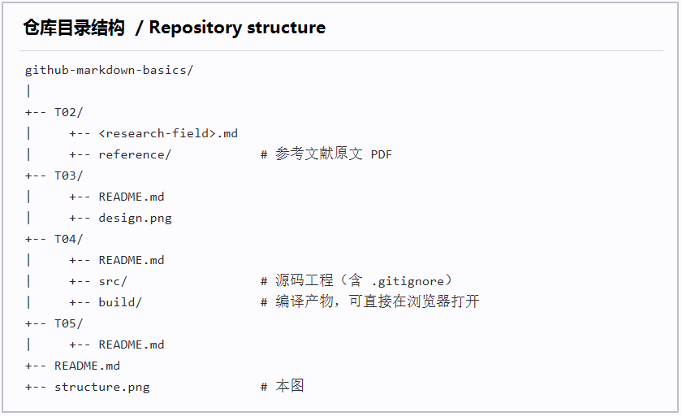

# GitHub 与 Markdown 基础作业

> 本仓库是「GitHub 与 Markdown 基础」作业的交付载体：T02–T05 四道题共用同一套目录结构，各自在自己的目录里产出。

## 一、目录结构



```text
github-markdown-basics/
├── T02/
│   ├── <所选研究领域>.md
│   └── reference/          # 参考文献原文 PDF
├── T03/
│   ├── README.md
│   └── design.png
├── T04/
│   ├── README.md
│   ├── src/                # 源码工程（含 .gitignore）
│   └── build/              # 编译产物，可直接浏览
└── T05/
    └── README.md
```

## 二、各目录说明

- **T02** —— 研究领域调研：正文为 `<所选研究领域>.md`，参考文献原文放在 `T02/reference/`。
- **T03** —— 见 [T03/README.md](T03/README.md)。
- **T04** —— 见 [T04/README.md](T04/README.md)：源码在 `T04/src/`，构建产物在 `T04/build/`，**可直接在浏览器打开**（不需要本地服务器）。
- **T05** —— 见 [T05/README.md](T05/README.md)。

## 三、完成状态

| 目录 | 内容 | 状态 |
| --- | --- | --- |
| T02 | 研究领域调研 | ⬜ 待开始 |
| T03 | 设计说明与设计图 | ⬜ 待开始 |
| T04 | 源码工程与可离线打开的产物 | 🚧 进行中 |
| T05 | 待补充 | ⬜ 待开始 |

图例：✅ 已完成 · 🚧 进行中 · ⬜ 待开始

## 四、在本地使用

```bash
git clone git@github.com:Suozhang12138/github-markdown-basics.git
cd github-markdown-basics
```

查看 T04 的构建产物不需要任何环境——它不依赖本地服务器：

```text
直接双击 T04/build/index.html
```

## 五、本仓库用到的 Markdown 语法

本仓库刻意用到了下列语法，便于对照检查：

1. 标题：本文件的 `#` 与 `##`
2. 列表：本节的有序列表，以及第二节的无序列表
3. 代码块：上面的围栏代码块，均带语言标注（`text`、`bash`）
4. 图片：本文开头的仓库目录结构图
5. 链接：指向各子目录 README 的相对链接，以及 [本仓库在 GitHub 上的地址](https://github.com/Suozhang12138/github-markdown-basics)

---

作业题目：1.1 GitHub 与 Markdown 基础（必做）。
